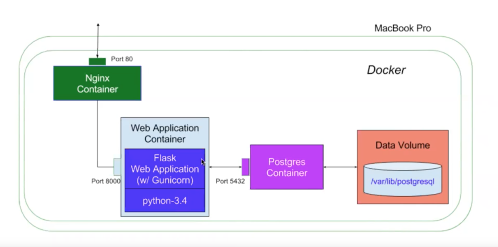

# README
This is my solution to the [Insight DevOps Engineering Systems Puzzle](https://github.com/InsightDataScience/systems-puzzle).

### The puzzle
The "puzzled" site has a structure as following.
 

### The bugs
- **Nginx** is using a wrong port, so the site is not accessible.
- There is a miss match of **Flask** port and system "expose" port, "502 Bad Gateway" issue.
- The database query is not processed correctly, so when new items are added, the site returns an empty list.

### The fixes
- Change ```docker-compose.yml``` file to change the port of nginx to 8080:80, so we can access the site via "localhost:8080".
- Change ```flaskapp.conf``` proxy_pass to "http://flaskapp:5000" to match Flask default port 5000; Also change "EXPOSE" to port 5000 in ```Dockerfile``` to match the port.
- In ```app.py```, list all the details of the database query.  The return of the query is a list of item objects, they could not be converted to strings for display.